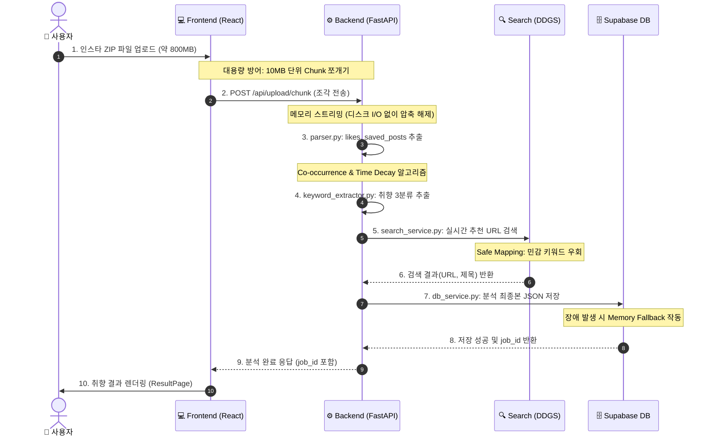

# InstaScope 시각적 설계도 (Architecture Blueprint)

이 문서는 InstaScope 애플리케이션의 전체 데이터 흐름과 백엔드 모듈 간의 의존성을 한눈에 파악하기 위해 작성된 **Mermaid 다이어그램 설계도**입니다.

## 1. 전체 시스템 데이터 파이프라인 (Data Pipeline)

사용자가 파일을 업로드하는 시점부터 분석 결과가 도출되어 화면에 그려지기까지의 전체 과정을 보여줍니다.



## 2. 백엔드 모듈 의존성 구조도 (Dependency Graph)

FastAPI 백엔드 내부의 각 Python 파일(`routes`, `services`)들이 어떻게 서로 데이터를 주고받으며 작동하는지 보여주는 컴포넌트 구조도입니다.

```mermaid
graph TD
    %% 노드 정의
    Router[api/routes.py\n(엔드포인트, 메모리 조립)]
    Parser[services/parser.py\n(JSON 구조 분해)]
    Extractor[services/keyword_extractor.py\n(동시 출현 알고리즘 엔진)]
    Search[services/search_service.py\n(DDGS 검색 및 필터링)]
    DB[services/db_service.py\n(Supabase 연동)]
    
    %% 데이터 흐름 (의존성)
    Router -- "1. 압축 해제된 JSON 전달" --> Parser
    Parser -- "2. 정제된 리스트(좋아요, 저장 등) 전달" --> Extractor
    Extractor -- "3. 추출된 핵심 키워드 전달" --> Search
    Search -- "4. 콘텐츠가 매핑된 최종 결과 객체 반환" --> Extractor
    Extractor -- "5. 최종 분석본 전달" --> DB
    DB -- "6. DB 저장 후 job_id 반환" --> Router
    
    %% 스타일링
    classDef router fill:#f9f,stroke:#333,stroke-width:2px;
    classDef service fill:#bbf,stroke:#333,stroke-width:2px;
    classDef engine fill:#fbf,stroke:#f66,stroke-width:3px;
    
    class Router router;
    class Parser,Search,DB service;
    class Extractor engine;
```

---
> **💡 활용 팁**: 이 다이어그램은 백엔드 로직의 호출 순서를 디버깅하거나, 새로운 개발자가 데이터의 이동 경로(Router ➡️ Parser ➡️ Extractor ➡️ DB)를 파악할 때 유용하게 활용할 수 있습니다.
