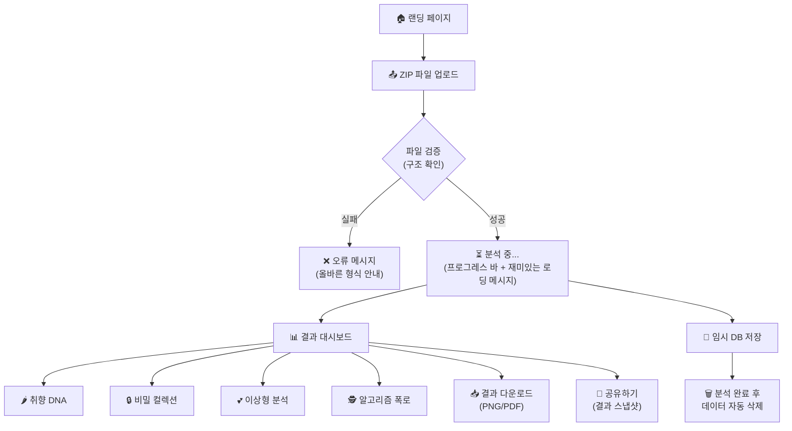
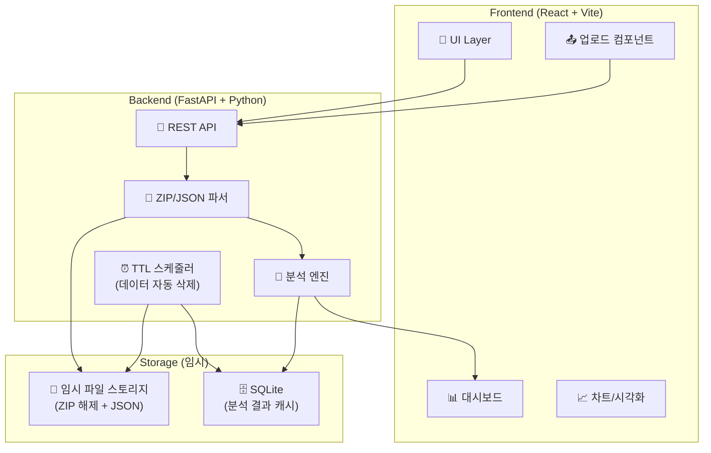
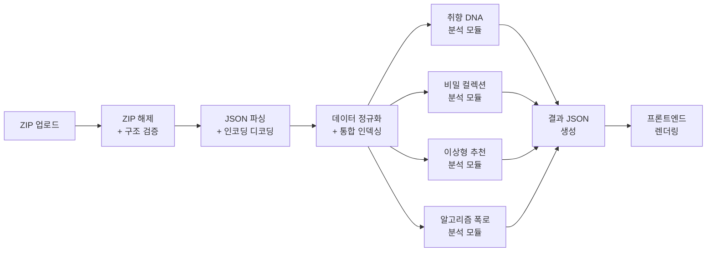

# 🔍 InstaScope — "인스타가 당신에 대해 아는 모든 것"

> 사용자가 인스타그램 데이터 다운로드(ZIP)를 업로드하면, 자동 분석 후 취향 DNA·비밀 컬렉션·이상형 계정·알고리즘 프로파일링 결과를 시각적으로 제공하는 웹 서비스

---

## 📋 1. PRD (Product Requirements Document)

### 1.1 제품 비전

| 항목 | 내용 |
|------|------|
| **제품명** | InstaScope (인스타스코프) |
| **한줄 설명** | "인스타가 당신에 대해 아는 모든 것을 보여드립니다" |
| **핵심 가치** | 사용자가 자신의 인스타 데이터를 업로드하면 → 자동 분석 → 시각적 보고서로 제공 |
| **타겟 유저** | 인스타를 활발히 사용하는 10~30대, 자기 데이터에 호기심 있는 사람 |
| **차별점** | 단순 통계가 아닌 "도파민 터지는" 인사이트 (비밀 취향, 이상형, 무의식 스토킹 등) |

### 1.2 핵심 원칙

> [!IMPORTANT]
> **데이터 처리 원칙**
> 1. 사용자 데이터는 **분석 직후 즉시 삭제** (임시 저장만)
> 2. 내 (개발자) 데이터는 **파일 구조/스키마 참고용**만 사용. 절대 학습/기반 데이터로 사용하지 않음
> 3. 분석 알고리즘은 **인스타그램 데이터 다운로드의 표준 구조**를 기반으로 설계
> 4. 모든 사용자의 데이터는 동일한 알고리즘으로 처리되며, 특정 사용자 편향 없음

### 1.3 핵심 기능 (Feature Set)

---

#### 🌶️ Feature 1: 취향 DNA 리포트 — "부드러움 ↔ 매콤함 ↔ 불닭"

**컨셉**: 사용자의 모든 상호작용 데이터를 분석하여 **취향 강도 스펙트럼**으로 시각화

**매운맛 지표 정의**:
| 등급 | 이름 | 의미 | 기준 |
|------|------|------|------|
| 🥛 | 부드러움 (Mild) | 주류·대중적 취향 | 팔로잉 계정 대부분이 친구/지인, 주류 해시태그 |
| 🌶️ | 매콤함 (Spicy) | 뚜렷한 서브컬처 취향 | 특정 카테고리에 집중된 좋아요/저장, 니치 해시태그 |
| 🔥 | 불닭 (Fire) | 극단적·몰입형 취향 | 저장만 하고 좋아요 안 누름, 새벽 집중 소비, 비밀 컬렉션 |

**분석 데이터 소스**:
- `liked_posts.json` → 좋아요 누른 게시물의 해시태그/캡션/소유자 분석
- `saved_posts.json` → 저장한 게시물 (좋아요 안 누른 것 = "비밀 취향")
- `videos_watched.json` → 시청한 영상의 캡션/해시태그
- `posts_viewed.json` → 피드에서 본 게시물
- `post_comments_1.json` + `reels_comments.json` → 댓글 작성 대상 분석
- `stories_viewed.json` + `story_likes.json` → 스토리 시청/좋아요

**출력 형태**:
- 🎯 **취향 레이더 차트** (5~7축): 예) 패션/여행/애니/자기계발/음식/유머/연예인
- 🌡️ **매운맛 게이지**: 부드러움~불닭 스펙트럼
- 📊 **상호작용 피라미드**: 조회 → 좋아요 → 저장 → 댓글 → DM 공유 단계별 분포
- 🕐 **시간대별 취향 변화**: 낮 vs 밤 관심사 비교 차트
- 📈 **취향 진화 타임라인**: 월별 해시태그 트렌드 변화

---

#### 🔒 Feature 2: 비밀 컬렉션 해부 — "남에게 보여주지 않는 취향"

**컨셉**: 저장 컬렉션을 역분석하여 사용자가 의식적으로 숨기는 취향을 발굴

**분석 데이터 소스**:
- `saved_collections.json` → 컬렉션 이름/유형/공개범위/포함 게시물
- `saved_posts.json` × `liked_posts.json` → 교차 분석 (저장O 좋아요X = 비밀 취향)
- `posts_you're_interested_or_not_interested_in.json` → 적극적 관심/비관심 표시

**분석 로직**:
```
비밀_취향_점수 = (저장 O + 좋아요 X) 게시물 수 / 전체 저장 수
공개_취향 = 좋아요 O + 저장 O 게시물의 카테고리
비밀_취향 = 저장 O + 좋아요 X 게시물의 카테고리
취향_괴리도 = 공개_취향과 비밀_취향의 코사인 유사도 역수
```

**출력 형태**:
- 🎭 **공개 vs 비밀 취향 대비 차트**: 양면 바 차트
- 📁 **컬렉션 카테고리 자동 분류**: 해시태그/캡션 기반 AI 카테고리화
- 🔥 **비밀 취향 강도 지표**: "당신의 비밀 취향 농도는 XX%"
- 📋 **컬렉션별 요약 카드**: 각 컬렉션의 주요 키워드 + 게시물 수

---

#### 💕 Feature 3: 이상형 계정 & 게시물 추천 — 메인 컨텐츠

**컨셉**: 좋아요/저장/스토리 상호작용 패턴에서 사용자의 "이상형 프로필"을 추론

**분석 데이터 소스**:
- `liked_posts.json` → 가장 많이 좋아요 누른 계정 Top N
- `story_likes.json` → 스토리 좋아요를 준 계정 (더 친밀한 관심)
- `stories_viewed.json` → 스토리를 가장 많이 본 계정
- `saved_posts.json` → 저장한 게시물의 소유자 계정
- `following.json` × `close_friends.json` → 관계 유형 교차
- `profiles_you've_favorited.json` → 즐겨찾기 프로필

**분석 로직**:
```
관심_점수(계정) = (좋아요_수 × 1) + (저장_수 × 2) + (스토리_시청_수 × 0.5) 
                 + (스토리_좋아요 × 3) + (댓글_수 × 4) + (DM_메시지_수 × 5)

카테고리_분류:
  - 친구/지인 (mutual follow + DM 존재)
  - 연예인/인플루언서 (일방 팔로우 + 높은 좋아요)  
  - 크리에이터/아티스트 (저장 위주)
  - 관심_대상 (높은 스토리 시청 + 좋아요 but DM 없음) ← "이상형 후보"
```

**출력 형태**:
- ❤️ **이상형 프로필 카드**: Top 10 관심 계정 (username + 관심 점수 + 상호작용 히스토리)
- 📊 **관심 유형 분류**: 친구 vs 인플루언서 vs 크리에이터 vs 관심_대상
- 🔗 **추천 게시물**: 사용자의 해시태그 패턴과 일치하는 URL 리스트 (이미 좋아요/저장한 것 기반)
- 💡 **"이런 계정도 좋아하실 수 있어요"**: 저장 컬렉션 카테고리 기반 추천 키워드

> [!NOTE]
> 외부 API 호출 없이, **사용자 자신의 데이터 내에서** 가장 관심이 높은 계정과 게시물을 재정렬하여 보여주는 방식. "추천"이 아닌 "당신이 이미 가장 좋아하는 것을 정리해드립니다" 컨셉.

---

#### 🕵️ Feature 4: 알고리즘 프로파일링 폭로 — 부가 기능

**컨셉**: "인스타가 당신을 이렇게 분류하고 있었습니다" 를 시각적으로 폭로

**분석 데이터 소스**:
- `other_categories_used_to_reach_you.json` → 광고 카테고리 (핵심!)
- `advertisers_using_your_activity_or_information.json` → 타겟팅한 광고주
- `ads_viewed.json` → 노출된 광고 히스토리
- `information_you've_submitted_to_advertisers.json` → 광고주에 제출한 정보
- `locations_of_interest.json` → 추적된 관심 위치
- `login_activity.json` → IP/디바이스/위치 추적 기록

**출력 형태**:
- 🏷️ **인스타 태그 클라우드**: 인스타가 붙인 광고 카테고리 시각화
- 🏢 **당신을 타겟팅한 광고주 TOP 20**: 카테고리별 그룹핑
- 🗺️ **위치 추적 맵**: 인스타가 파악한 관심 위치 목록
- 📱 **디바이스 프로필**: 기기/브라우저/접속 패턴
- ⚠️ **프라이버시 위험도 점수**: 노출된 개인정보 수준 평가

---

### 1.4 사용자 플로우



---

## 📐 2. 시스템 아키텍처

### 2.1 전체 구조



### 2.2 분석 엔진 파이프라인



---

## 🛠️ 3. 기술 스택

### 3.1 Frontend

| 기술 | 용도 | 선정 이유 |
|------|------|-----------|
| **Vite + React** | SPA 프레임워크 | 빠른 HMR, 가벼운 번들, 컴포넌트 기반 |
| **Vanilla CSS** (커스텀 디자인 시스템) | 스타일링 | 완전한 커스텀 제어, 글래스모피즘/다크모드 |
| **Chart.js** | 레이더 차트, 바 차트, 라인 차트 | 가볍고 예쁜 차트, React 래퍼 존재 |
| **Framer Motion** | 애니메이션 | 부드러운 페이지 전환, 마이크로 인터랙션 |
| **React Dropzone** | 파일 업로드 | Drag & Drop ZIP 업로드 UX |
| **html2canvas** | 결과 이미지 저장 | 분석 결과를 PNG로 캡처 |

### 3.2 Backend

| 기술 | 용도 | 선정 이유 |
|------|------|-----------|
| **Python 3.12+** | 백엔드 언어 | JSON 파싱, 데이터 분석에 최적 |
| **FastAPI** | REST API 서버 | 비동기, 자동 문서화, 타입 안전성 |
| **Uvicorn** | ASGI 서버 | FastAPI 구동 |
| **zipfile** (표준 라이브러리) | ZIP 해제 | 별도 설치 불필요 |
| **pandas** | 데이터 분석/집계 | 대용량 JSON 고속 처리 |
| **APScheduler** | 임시 데이터 삭제 스케줄러 | TTL 기반 자동 정리 |
| **python-multipart** | 파일 업로드 처리 | FastAPI 파일 업로드 의존성 |

### 3.3 Database / Storage

| 기술 | 용도 | 선정 이유 |
|------|------|-----------|
| **SQLite** | 분석 결과 임시 저장 | 무설치, 파일 기반, 경량 |
| **파일 시스템 (temp dir)** | ZIP 해제 + JSON 임시 저장 | 분석 후 즉시 삭제 |

> [!NOTE]
> 초기 개발 단계에서는 SQLite + 로컬 파일시스템으로 충분.
> 추후 사용자 증가 시 PostgreSQL + S3 임시 스토리지로 마이그레이션 가능.

### 3.4 프로젝트 디렉토리 구조 (예정)

```
instascope/
├── frontend/                      # Vite + React
│   ├── public/
│   ├── src/
│   │   ├── assets/                # 폰트, 이미지, 아이콘
│   │   ├── components/            # 재사용 가능 컴포넌트
│   │   │   ├── Upload/            # 파일 업로드 영역
│   │   │   ├── Dashboard/         # 결과 대시보드
│   │   │   ├── Charts/            # 차트 컴포넌트들
│   │   │   │   ├── RadarChart.jsx     # 취향 레이더
│   │   │   │   ├── SpicyGauge.jsx     # 매운맛 게이지
│   │   │   │   ├── PyramidChart.jsx   # 상호작용 피라미드
│   │   │   │   ├── TimeHeatmap.jsx    # 시간대별 히트맵
│   │   │   │   └── TagCloud.jsx       # 태그 클라우드
│   │   │   ├── Cards/             # 결과 카드 UI
│   │   │   └── Layout/            # 레이아웃 (네비게이션 등)
│   │   ├── pages/                 # 페이지 컴포넌트
│   │   │   ├── Landing.jsx
│   │   │   ├── Analyzing.jsx      # 분석 중 로딩 페이지
│   │   │   └── Results.jsx        # 결과 대시보드 페이지
│   │   ├── hooks/                 # 커스텀 훅
│   │   ├── utils/                 # 유틸리티
│   │   ├── styles/                # CSS 파일
│   │   │   ├── index.css          # 글로벌 디자인 시스템
│   │   │   ├── variables.css      # CSS 변수
│   │   │   └── components/        # 컴포넌트별 CSS
│   │   ├── App.jsx
│   │   └── main.jsx
│   ├── index.html
│   ├── vite.config.js
│   └── package.json
│
├── backend/                       # FastAPI + Python
│   ├── app/
│   │   ├── __init__.py
│   │   ├── main.py                # FastAPI 앱 엔트리포인트
│   │   ├── api/
│   │   │   ├── __init__.py
│   │   │   ├── routes.py          # API 라우트 정의
│   │   │   └── schemas.py         # Pydantic 응답 스키마
│   │   ├── core/
│   │   │   ├── __init__.py
│   │   │   ├── config.py          # 설정 (TTL, 경로 등)
│   │   │   └── security.py        # 파일 검증, 사이즈 제한
│   │   ├── services/
│   │   │   ├── __init__.py
│   │   │   ├── parser.py          # ZIP 해제 + JSON 파싱 + 인코딩 처리
│   │   │   ├── normalizer.py      # 데이터 정규화 (label_values → 통합 구조)
│   │   │   ├── taste_dna.py       # 취향 DNA 분석 엔진
│   │   │   ├── secret_collection.py # 비밀 컬렉션 분석 엔진
│   │   │   ├── ideal_type.py      # 이상형 분석 엔진
│   │   │   ├── algorithm_expose.py # 알고리즘 폭로 엔진
│   │   │   └── recommender.py     # 추천 로직
│   │   ├── models/
│   │   │   ├── __init__.py
│   │   │   └── database.py        # SQLite 모델
│   │   └── utils/
│   │       ├── __init__.py
│   │       ├── encoding.py        # Latin-1 이중 인코딩 디코더
│   │       └── cleanup.py         # 임시 데이터 삭제 스케줄러
│   ├── requirements.txt
│   └── tests/
│       └── test_parser.py
│
├── data/                          # 임시 데이터 디렉토리 (gitignored)
│   └── temp/                      # 업로드된 ZIP + 해제 파일
│
└── README.md
```

---

## 📊 4. 데이터 파이프라인 상세 설계

### 4.1 필수 입력 데이터 (사용자 ZIP에서 추출)

| 우선순위 | 경로 | 용도 | Feature |
|----------|------|------|---------|
| 🔴 필수 | `your_instagram_activity/likes/liked_posts.json` | 좋아요 분석 | F1, F3 |
| 🔴 필수 | `your_instagram_activity/saved/saved_posts.json` | 저장 분석 | F1, F2, F3 |
| 🔴 필수 | `your_instagram_activity/saved/saved_collections.json` | 컬렉션 분류 | F2 |
| 🔴 필수 | `connections/followers_and_following/following.json` | 팔로잉 | F3 |
| 🔴 필수 | `connections/followers_and_following/followers_1.json` | 팔로워 | F3 |
| 🟡 권장 | `ads_information/ads_and_topics/videos_watched.json` | 영상 시청 | F1 |
| 🟡 권장 | `ads_information/ads_and_topics/posts_viewed.json` | 게시물 시청 | F1 |
| 🟡 권장 | `your_instagram_activity/story_interactions/stories_viewed.json` | 스토리 시청 | F3 |
| 🟡 권장 | `your_instagram_activity/story_interactions/story_likes.json` | 스토리 좋아요 | F3 |
| 🟡 권장 | `your_instagram_activity/comments/post_comments_1.json` | 댓글 | F1, F3 |
| 🟡 권장 | `your_instagram_activity/comments/reels_comments.json` | 릴스 댓글 | F1, F3 |
| 🟡 권장 | `connections/followers_and_following/close_friends.json` | 친한 친구 | F3 |
| 🟡 권장 | `connections/followers_and_following/profiles_you've_favorited.json` | 즐겨찾기 | F3 |
| 🟢 선택 | `ads_information/instagram_ads_and_businesses/other_categories_used_to_reach_you.json` | 광고 카테고리 | F4 |
| 🟢 선택 | `ads_information/instagram_ads_and_businesses/advertisers_using_your_activity_or_information.json` | 광고주 | F4 |
| 🟢 선택 | `personal_information/information_about_you/locations_of_interest.json` | 위치 | F4 |
| 🟢 선택 | `security_and_login_information/login_and_profile_creation/login_activity.json` | 로그인 | F4 |
| 🟢 선택 | `ads_information/ads_and_topics/posts_you're_interested_or_not_interested_in.json` | 관심/비관심 | F1, F2 |

### 4.2 JSON 파싱 통합 전략

인스타 데이터에는 **3가지 스키마 패턴**이 존재하며, 파서에서 이를 통합 구조로 정규화:

```python
# 통합 정규화 출력 구조 (normalizer.py)
NormalizedRecord = {
    "timestamp": int,           # Unix timestamp
    "type": str,                # "like", "save", "view", "comment", "story_view", ...
    "url": str | None,          # 게시물/릴스 URL
    "caption": str | None,      # 디코딩된 캡션
    "hashtags": list[str],      # 추출된 해시태그
    "owner_username": str | None,  # 게시물 소유자
    "owner_name": str | None,      # 소유자 이름 (한글 등)
    "source": str,              # 원본 파일명
}
```

### 4.3 인코딩 디코더 (핵심 유틸리티)

```python
# encoding.py — Latin-1 이중 인코딩 디코더
def decode_instagram_text(text: str) -> str:
    """인스타 JSON의 이중 인코딩된 텍스트를 정상 UTF-8로 디코딩"""
    try:
        return text.encode('latin-1').decode('utf-8')
    except (UnicodeDecodeError, UnicodeEncodeError):
        return text
```

---

## 🎨 5. UI/UX 설계 방향

### 5.1 디자인 톤앤매너

| 요소 | 방향 |
|------|------|
| **색상** | 다크 모드 베이스 + 네온 그라디언트 (인스타 색감 오마주: 퍼플-핑크-오렌지) |
| **폰트** | Pretendard (한글) + Inter (영문) — 깔끔한 모던 느낌 |
| **스타일** | 글래스모피즘 카드 + 부드러운 그라디언트 배경 |
| **애니메이션** | 결과 카드 순차 등장, 차트 그리기 애니메이션, 스크롤 트리거 |
| **레이아웃** | 스크롤 기반 스토리텔링 (위→아래로 읽으며 분석 결과 발견) |

### 5.2 핵심 페이지

| # | 페이지 | 설명 |
|---|--------|------|
| 1 | **Landing** | 히어로 + 서비스 설명 + CTA "지금 분석하기" |
| 2 | **Upload** | Drag & Drop 업로드 + 가이드 (인스타 데이터 다운로드 방법) |
| 3 | **Analyzing** | 로딩 + 프로그레스 바 + 재미있는 분석 중 메시지 |
| 4 | **Results** | 풀 스크롤 대시보드 (4개 Feature 섹션) |

---

## User Review Required

> [!IMPORTANT]
> **결정이 필요한 사항들**:
> 1. **결과 공유 기능**: 분석 결과를 이미지로 저장/SNS 공유 기능 필요한지?
> 2. **데이터 보존 기간**: 임시 저장 TTL을 얼마로 할지? (제안: 분석 완료 후 1시간, 또는 세션 종료 즉시)
> 3. **배포 환경**: 일단 로컬 개발용으로 시작하고, 추후 Vercel(프론트) + Railway/Render(백엔드) 배포?
> 4. **DM 분석 포함 여부**: DM 데이터까지 분석하면 이상형 추천 정확도가 올라가지만, 프라이버시 민감도도 높아짐. 포함할지?

## Open Questions

> [!WARNING]
> **"이상형 계정 추천"의 범위 정의**:
> - 현재 설계는 **사용자의 기존 데이터 내에서** 관심 점수가 높은 계정을 재정렬하는 방식
> - 외부 인스타 API를 연동하여 "새로운 계정"을 추천하는 것은 API 제한으로 현실적으로 불가
> - 대안: 사용자의 해시태그 패턴을 기반으로 "이런 해시태그로 검색해보세요" 식의 키워드 추천?

---

## 📅 6. 실행 계획 (Phase별)

### Phase 1: 기반 구축 (Backend 핵심)
- [ ] 프로젝트 초기화 (Vite + FastAPI)
- [ ] `parser.py` — ZIP 해제 + JSON 파싱 + 인코딩 디코더
- [ ] `normalizer.py` — 3가지 스키마 패턴 → 통합 구조 변환
- [ ] 파일 검증 로직 (필수 파일 존재 확인)
- [ ] API 엔드포인트: `/api/upload`, `/api/status/{id}`, `/api/results/{id}`

### Phase 2: 분석 엔진 구현
- [ ] `taste_dna.py` — 취향 DNA 분석 (해시태그 집계, 카테고리 분류, 매운맛 지표)
- [ ] `secret_collection.py` — 비밀 컬렉션 분석 (저장×좋아요 교차)
- [ ] `ideal_type.py` — 이상형 분석 (계정별 관심 점수 계산)
- [ ] `algorithm_expose.py` — 알고리즘 폭로 (광고 카테고리 파싱)
- [ ] `recommender.py` — 추천 로직 (해시태그 기반 게시물 재정렬)

### Phase 3: Frontend 구현
- [ ] 디자인 시스템 (CSS variables, 글로벌 스타일)
- [ ] Landing 페이지 + Upload 컴포넌트
- [ ] Analyzing 로딩 페이지
- [ ] Results 대시보드 (4개 Feature 섹션)
- [ ] 차트 컴포넌트 (레이더, 게이지, 히트맵, 태그 클라우드)

### Phase 4: 통합 + 마무리
- [ ] Frontend ↔ Backend API 연동
- [ ] 임시 데이터 삭제 스케줄러
- [ ] 결과 이미지 저장/공유 기능
- [ ] 반응형 디자인 (모바일 대응)
- [ ] 최종 테스트 + 버그 수정

---

## ✅ Verification Plan

### Automated Tests
- `pytest backend/tests/` — 파서, 인코딩 디코더, 분석 엔진 단위 테스트
- 내 데이터를 테스트 입력으로 사용하여 파이프라인 정상 동작 검증

### Manual Verification
- 다른 인스타 계정의 데이터 다운로드로 범용성 확인
- 프론트엔드 시각화 결과물 스크린샷 리뷰
