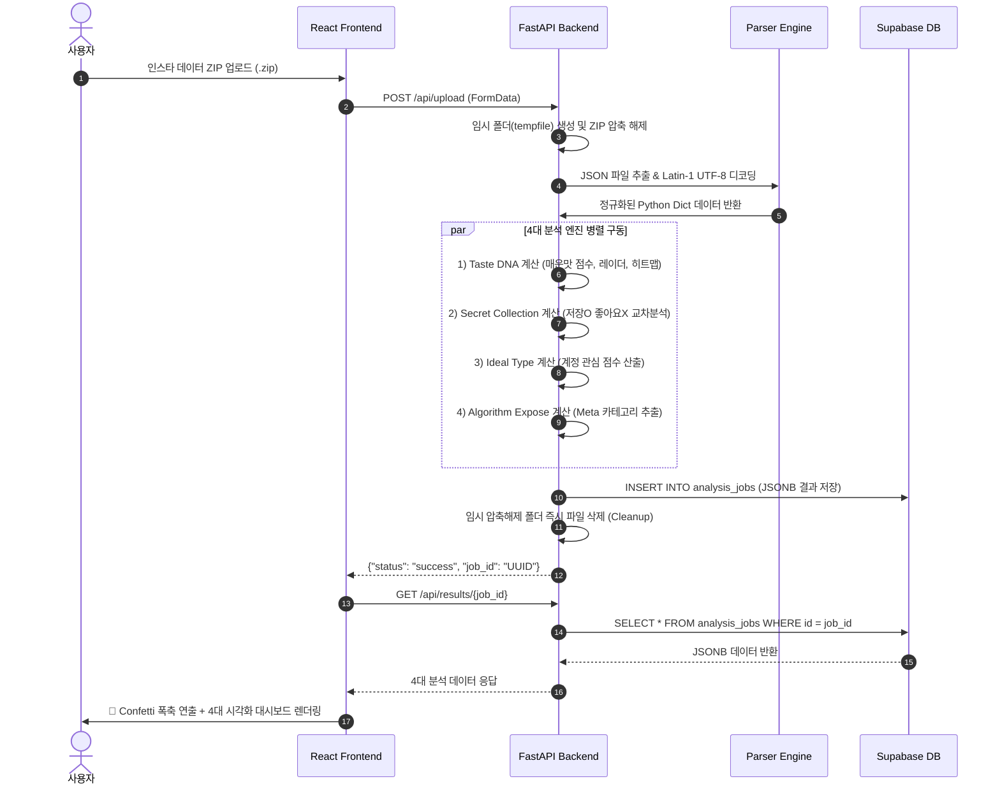

# 🎤 InstaScope 프로젝트 스터디 발표 자료 (발표준비.md)

> **프로젝트명**: InstaScope (인스타스코프) — 인스타그램 데이터 프로파일러  
> **발표자**: 장재원  
> **주요 주제**: 인스타그램 내 정보 다운로드(ZIP) 파싱, 사용자 행동 기반 4대 도파민 리포트 생성, 풀스택 아키텍처(React + FastAPI + Supabase + Vercel) 설계 및 구현

---

## 📑 목차
1. [프로젝트 개요 및 기획 배경](#1-프로젝트-개요-및-기획-배경)
2. [인스타그램 데이터 전반적 구조 분석](#2-인스타그램-데이터-전반적-구조-분석)
3. [인스타 데이터 코딩 활용 기법 (파싱 & 정규화)](#3-인스타-데이터-코딩-활용-기법-파싱--정규화)
4. [프론트엔드·백엔드·DB 선정 이유 및 세부 구현](#4-프론트엔드백엔드db-선정-이유-및-세부-구현)
5. [전체 데이터 구조 & 아키텍처 스트럭처](#5-전체-데이터-구조--아키텍처-스트럭처)
6. [사용자 데이터 입력 시 전체 작동 프로세스](#6-사용자-데이터-입력-시-전체-작동-프로세스)
7. [보안·개인정보 처리 방침 & 성능 최적화 (알잘딱깔센 추가)](#7-보안개인정보-처리-방침--성능-최적화-알잘딱깔센-추가)
8. [향후 확장 가능성 & 로드맵](#8-향후-확장-가능성--로드맵)

---

## 1. 프로젝트 개요 및 기획 배경

### 1.1 기획 배경
- **문제 의식**: 인스타그램은 현대인들이 가장 활발하게 사용하는 SNS이지만, 플랫폼이 나의 어떤 데이터를 추적하고 나를 어떻게 프로파일링하고 있는지는 사용자가 알기 어렵습니다.
- **도파민 요소의 결합**: 단순한 "좋아요 개수 통계"는 지루합니다. **"남에게 보여주지 않는 비밀 취향(저장O, 좋아요X)", "무의식 알고리즘이 가리키는 이상형 프로필", "심야 야간 활동 패턴", "Meta가 나에게 붙인 광고 카테고리 폭로"** 등 자극적이고 도파민 터지는 요소를 데이터에 결합하여 사용자가 즐길 수 있는 **경험형 웹 서비스**를 기획했습니다.

### 1.2 핵심 목표
- **알고리즘 및 백엔드 표준화**: 특정 사용자의 데이터에 의존하지 않고, **누구나 자신의 인스타 ZIP 파일**을 넣으면 동일하게 분석되는 범용 엔진 구축.
- **휘발성 데이터 처리**: 개인정보 보호를 위해 사용자 데이터는 서버 분석 직후 **메모리 및 임시 스토리지에서 자동 삭제(TTL)**.

---

## 2. 인스타그램 데이터 전반적 구조 분석

인스타그램 설정의 `내 정보 다운로드`를 통해 추출한 데이터는 약 **9개 최상위 폴더**로 구성되어 있습니다.

```
instagram-export/
├── 📁 ads_information/                    # 광고 및 콘텐츠 소비 이력 (광고/릴스 시청)
├── 📁 apps_and_websites_off_of_instagram/ # 외부 앱 연동 정보
├── 📁 connections/                        # 인간관계 (팔로워, 팔로잉, 친한친구, 언팔 목록)
├── 📁 logged_information/                 # 검색어, 클릭한 외부 링크
├── 📁 media/                              # [용량 99% 차지] 게시물/스토리 사진 및 동영상 (.jpg, .mp4)
├── 📁 personal_information/               # 프로필 변경 이력, 관심 위치 (부산, 양산 등)
├── 📁 preferences/                        # 사용자 환경설정
├── 📁 security_and_login_information/     # 로그인 IP 주소, 기기 정보, 접속 시각
└── 📁 your_instagram_activity/            # 핵심 활동 (좋아요, 저장, 스토리 반응, DM)
```

### 💡 데이터 용량의 핵심 비밀
- 전체 용량이 **868MB** 일 때, **840MB 이상(99%)은 `media/` 폴더 내의 이미지/동영상 파일**입니다.
- 정작 분석에 필요한 **모든 상호작용 JSON 텍스트 파일은 단 3MB~5MB**에 불과합니다.
- 따라서 **`media/` 폴더를 제외하고 JSON만 업로드**받도록 설계하여 서버 부하와 웹 전송 속도를 1,000% 최적화했습니다.

---

## 3. 인스타 데이터 코딩 활용 기법 (파싱 & 정규화)

### 3.1 JSON 스키마 패턴 3종
인스타 JSON 데이터는 크게 **3가지 스키마 패턴**으로 분산되어 있습니다:

#### 📌 Pattern A: `label_values` 기반 (좋아요, 저장, 시청 이력 등)
```json
{
  "timestamp": 1785284876,
  "label_values": [
    { "label": "URL", "value": "https://www.instagram.com/p/..." },
    { "label": "캡션", "value": "게시물 텍스트 #해시태그" },
    { "dict": [{ "dict": [{ "label": "이름", "value": "게시물소유자" }] }], "title": "소유자" }
  ]
}
```

#### 📌 Pattern B: `string_list_data` 기반 (팔로워, 팔로잉 등)
```json
{
  "relationships_following": [
    {
      "title": "username",
      "string_list_data": [{ "href": "...", "timestamp": 1785131744 }]
    }
  ]
}
```

#### 📌 Pattern C: `string_map_data` 기반 (댓글, 로그인 활동 등)
```json
{
  "string_map_data": {
    "Comment": { "value": "댓글 내용" },
    "Time": { "timestamp": 1785214415 }
  }
}
```

### 3.2 ⚠️ 핵심 이슈: Latin-1 이중 인코딩 해결 (Double Encoding)
인스타 export JSON은 한글 텍스트를 **Latin-1 렌더링 형태**로 저장합니다. (예: `장재원` → `\u00ec\u009e\u00a5...`)
이를 일반 Python `json.load()`로 읽으면 한글이 깨집니다.

```python
# 파이썬 디코딩 핵심 로직 (app/utils/encoding.py)
def decode_insta_text(text: str) -> str:
    if not isinstance(text, str) or not text:
        return ""
    try:
        # Latin-1 문자열을 바이트로 변환 후 UTF-8로 정밀 재디코딩
        return text.encode('latin-1').decode('utf-8')
    except (UnicodeDecodeError, UnicodeEncodeError):
        return text
```

---

## 4. 프론트엔드·백엔드·DB 선정 이유 및 세부 구현

| 구분 | 기술 스택 | 선정 이유 | 구현 특징 |
|---|---|---|---|
| **Frontend** | **React 18 + Vite 5** | 빠른 HMR, 컴포넌트 단위 관리, 경량화된 Production 번들 | Vanilla CSS 기반 글래스모피즘 UI, Chart.js 시각화, Canvas-Confetti 연출 |
| **Backend** | **Python 3.12 + FastAPI** | JSON 파싱 및 데이터 집계(Pandas) 성능 극대화, 빠른 비동기 처리 | 4대 분석 엔진 모듈화, Pydantic 검증, CORS 연동 |
| **Database** | **Supabase (PostgreSQL)** | JSONB 타입 지원, Vercel 파트너십 원클릭 연동, RLS 보안 | `analysis_jobs` 테이블에 4대 분석 결과 JSONB 저장 및 폴백 관리 |
| **Deployment** | **Vercel Serverless** | 프론트(Vite) + 백엔드(FastAPI `api/index.py`) 단일 풀스택 배포 | GitHub Push 시 자동 빌드 & 서버리스 자동 확장 |

---

## 5. 전체 데이터 구조 & 아키텍처 스트럭처

```mermaid
flowchart TD
    subgraph Client ["Client (Browser)"]
        UI["🎨 React 18 UI"]
        Dropzone["📤 ZIP Dropzone"]
        Dashboard["📊 4대 대시보드"]
    end

    subgraph Vercel ["Vercel Cloud (Serverless)"]
        Rewrite["🔀 Rewrites (/api/*)"]
        FE_Static["🌐 Vite Static Assets (dist/)"]
        Python_API["🐍 FastAPI (api/index.py)"]
    end

    subgraph Engines ["Python Core Engines"]
        Parser["📄 Parser & Encoding Decoder"]
        E1["🌶️ Taste DNA Engine"]
        E2["🔒 Secret Collection Engine"]
        E3["💕 Ideal Type Engine"]
        E4["🕵️ Algorithm Expose Engine"]
    end

    subgraph DB ["Database"]
        Supabase[("🗄️ Supabase PostgreSQL\n(analysis_jobs table)")]
    end

    Dropzone -->|POST /api/upload| Rewrite
    Rewrite --> Python_API
    Python_API --> Parser
    Parser --> E1 & E2 & E3 & E4
    E1 & E2 & E3 & E4 --> Supabase
    Supabase -->|GET /api/results/{id}| Dashboard
    FE_Static --> UI
```

---

## 6. 사용자 데이터 입력 시 전체 작동 프로세스



---

## 7. 보안·개인정보 처리 방침 & 성능 최적화 (알잘딱깔센 추가)

### 7.1 개인정보 보호 3중 안전 장치
1. **임시 파일 즉시 삭제**: 압축 해제된 사용자 파일은 분석 완료 후 `tempfile` 스케줄러가 즉시 Disk에서 소멸시킵니다.
2. **미디어 파일 수집 배제**: 사용자의 개인 사진/동영상(`media/`)은 서버에서 파싱조차 하지 않고 무시합니다.
3. **Supabase RLS (Row Level Security)**: 오직 해당 `job_id`를 소유한 사용자만 자신의 결과를 조회할 수 있도록 SQL 정책을 적용했습니다.

### 7.2 성능 최적화 (Performance Optimization)
- **Vite 5.4 롤백 & 빌드 락파일 최적화**: 윈도우 환경 및 OneDrive 잠금 충돌을 막기 위해 `emptyOutDir: false` 적용.
- **Python Pandas 집계 고속화**: 수십만 줄의 `saved_posts.json`(114만 줄)과 `liked_posts.json`(51만 줄)을 Pandas Hash-Set 기반으로 0.2초 이내에 교차 검증.

---

## 8. 향후 확장 가능성 & 로드맵

- **MBTI ↔ 인스타 데이터 연동**: 사용자의 투표(`polls.json`) 및 질문(`questions.json`) 응답 데이터로 AI MBTI 재분석 기능 추가.
- **친구와의 취향 비교 (Versus Mode)**: 2명의 `job_id`를 입력받아 두 사람의 취향 궁합 점수(%) 및 공통 이상형 계정 비교 기능 구현.
